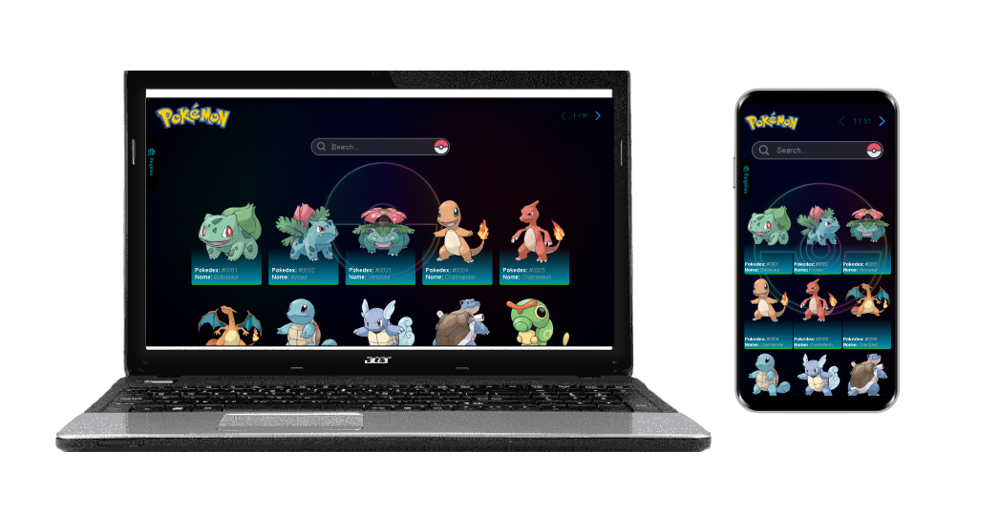
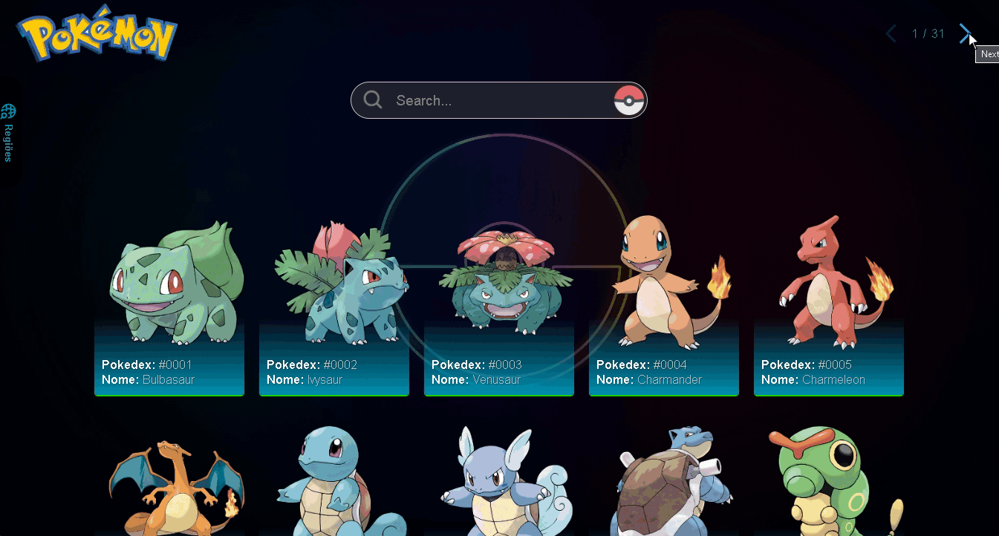

# 💻Projeto Pokedex

## __📌Descrição__
O projeto é uma página que tem como objetivo apresentar as informações referentes aos Pokémons que foram lançados da 1ª à 8ª geração, sendo ao todo 905 monstros contidos no site.

## 🛠️Ferramentas

  

    React
  

  

    HTML
  

  

    CSS
  

  

    JavaScript
  

    Jest
  

## __📽️Previa__

## __🏆Conclusão__
O aprimoramento desse projeto ajudou-me a aprimorar minhas técnicas no uso do Jest, que é uma biblioteca de testes unitários.

O objetivo do Jest é testar se o código está se comportando como o esperado. Além disso, foi possível aplicar minha habilidade mais recente, que é o gerenciamento de estado pela URL, esse recurso permite o salvamento de informações na URL do navegador, possibilitando restaurar o estado da página ao acessá-la em outro dispositivo ou no mesmo dispositivo pela mesma URL. 

Essas foram as principais habilidades colocadas em prática no aprimoramento desse projeto.